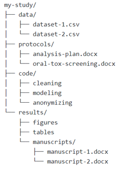

# Guidance: File organization

## Organize study-related files and folders into a single study folder

Organize all [study files/resources](../terms/index.md#study-filesresources) into a single study folder/directory. A study folder/directory may of course have sub-directories. See below for an example of a recommended study folder/directory structure.

## Organize study-related files into folders with consistent naming conventions

* Organize all your files (whether you will share them or not), into folders.
* In general, **minimize the number of folders** at each level, and the number of 'layers' of your whole directory.
    *   File naming conventions can often be used quite effectively to 'organize' files and to provide clues as to what the files are and how they relate to each other without resorting to using separation into different directories to serve that purpose.
* However, there is a limit to naming conventions, and you may want to separate your files into directors based on some type of logical groupings and/or based on th elevel or timing of access to the files you expect to provide. See below for further details.

    !!! note "Reminder"
        Before creating more directories or directory layers, consider whether file-naming conventions may be used more efficiently to create this organization.

## Create logical groupings
There are a number of ways to group files logically. Below are some examples of how you can logically group your files in folder structures:

| Grouping strategy      | Examples                                                  |
| :---------             | :---------------------------------------------------------|
| By file category       | Raw data grouped together; processed data grouped together;  protocols grouped together; data dictionaries grouped together|
| By experimental subject| All raw data files from a particular cell (across all protocols grouped  together, etc.) |
| By type of experiment  | All current clamp experiment files grouped together; all voltage   clamp experiment files grouped together |
| By experiment          | All raw data files mkdocsfrom a particular protocol, across all cells to which   the protocol applies, grouped together |
| By file type           | All CorelDraw figure files grouped together |
| By expected use        | All files you expect a primary or secondary user of the data/metadata   would want to use and/or cite together (as a package) - for example,   grouping files that you expect you will want to provide different levels   of access to/access restrictions for and/or that you want to provide  access to with different timing. See below for more information on  access level and timing.

